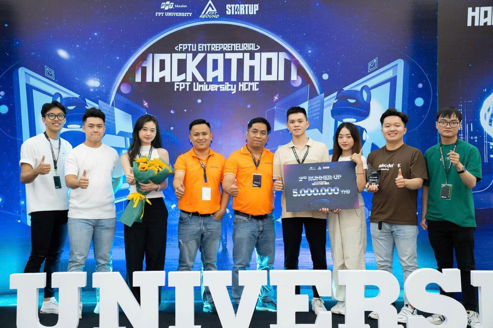

# Pet Care Project - Booking Food and Homestays for Pets 🐾

Welcome to my repository for the Pet Care Project! This platform provides a seamless solution for pet owners to book food and homestay services for their pets.

## 🏆 Project Overview
[Link to Prize](https://www.facebook.com/share/paqx9UgenYGDfoWT/?mibextid=WC7FNe)

The Pet Care project aims to connect pet owners with reliable service providers for booking food and homestays. Our solution addresses the challenge of ensuring pets receive quality care and nutrition while their owners are away. The platform simplifies the booking process, allowing users to find and reserve services that meet their pets' needs easily.

## 🚀 Technology Stack
- **Frontend**: FLUTTER
- **Backend**: C#, Dot NET
- **Database**: MSSQL
- **Other Tools**: Azure for deployment

## 📂 Project Structure
- **/src**: Contains the source code of the project.
- **/docs**: Includes any documentation or resources used in the project.

## 📄 Project Code
The full project code can be found here:  
[Link to Project Code](https://github.com/fanglong-it/PetinyAPI)

## 📬 Contact
Feel free to reach out to me at fang.longpc@gmail.com for any questions or collaboration opportunities!
